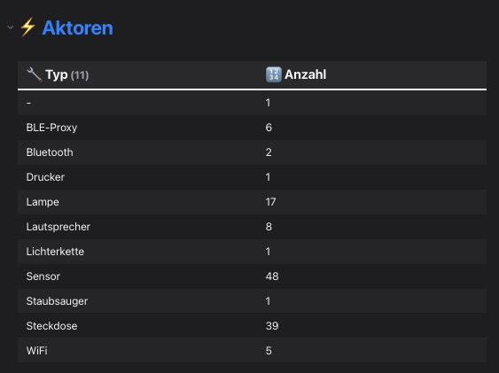
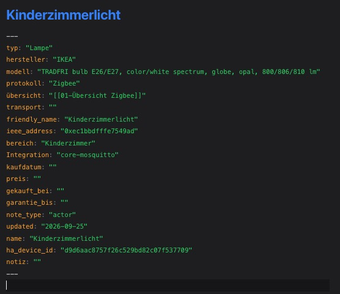

# Device Inventory Notes

**Sprache:** Deutsch | [English](README.en.md)

Home Assistant weiß, welche Geräte es gibt. Diese Information steckt in den
Registries, aber sie lässt sich nirgends als Liste abrufen, die man zeigen
kann. Wer ein Inventar führt, baut es heute aus zwei Teilen zusammen: den
technischen Daten aus Home Assistant, und allem, was Home Assistant nicht weiß,
aus dem Gedächtnis.

Diese Integration macht daraus Notizen.

[](https://my.home-assistant.io/redirect/hacs_repository/?owner=ArnaudFeld&repository=device-inventory-notes&category=integration)



*Die Gesamtübersicht zählt die Aktoren nach Typ. Die Tabelle ist eine
Dataview-Abfrage, sie aktualisiert sich mit jedem Lauf.*

## Wofür sie existiert

Für jedes Gerät wird eine Markdown-Notiz mit YAML-Frontmatter geschrieben, eine
je Gerät, sortiert nach Protokoll oder nach Bereich. Was Home Assistant weiß,
steht drin. Was es nicht weiß, bleibt leer und gehört dir.

Diese Felder werden nie überschrieben:

`lagerort` · `menge` · `kaufdatum` · `preis` · `gekauft_bei` · `garantie_bis` ·
`notiz` · `transport`

Der Rest folgt Home Assistant. Wird ein Gerät dort umbenannt, zieht die Notiz
mit, die Handfelder bleiben erhalten. Wird ein Gerät in Home Assistant gelöscht,
verschwindet auch die Notiz, mit Eintrag im Änderungsprotokoll.

`transport` ist der eine Sonderfall unter ihnen: Das Feld ist nicht handgepflegt,
sondern wird bei Matter-Geräten aus den Diagnose-Entitäten abgeleitet, `Thread`
oder `WiFi`. Ein vorhandener Wert bleibt erhalten, ein leeres wird gefüllt. Bei
allen anderen Protokollen bleibt das Feld leer.

## Was du bekommst



*Eine erzeugte Notiz im Quelltextmodus. Oben die Felder aus Home Assistant,
unten die Handfelder, die die Integration nie anfasst.*

- **Eine Notiz pro Gerät**, mit Name, Hersteller, Modell, Protokoll, Typ und
  Gerätekennung. Bei Zigbee zusätzlich mit `ieee_address`.
- **Verknüpfung im Obsidian-Graphen.** Jede Notiz trägt ein `übersicht`-Feld mit
  Wikilink auf ihre Protokoll-Übersicht. Dataview-Tabellen allein erzeugen keine
  Graph-Kanten, dieser Wikilink schon.
- **Übersichtsseiten** pro Protokoll und eine Gesamtübersicht, mit
  Dataview-Abfragen, die nach Typ, Hersteller und Ort sortieren.
- **Änderungsprotokoll** über die letzten 20 Läufe, mit den Zählern *Neu*,
  *Umbenannt*, *Geändert* und *Entfernt*.
- **Benachrichtigung**, wenn sich wirklich etwas geändert hat. Der erste Lauf
  nach der Einrichtung etabliert nur den Ausgangsstand und meldet nichts.
- **ZIP-Archiv** unter `/local/device_inventory_notes.zip`, plus ein
  www-Spiegel zum Nachlesen.

### Was es nicht macht

Die Integration erfindet keine Information. Wo Home Assistant nichts weiß,
bleibt das Feld leer, und `typ` fällt dann auf den Protokollnamen zurück, weil
das die ehrlichste vorhandene Bezeichnung ist. Geräte ohne Hersteller und ohne
Modell werden übersprungen, ebenso Koordinatoren, Bridges und andere
Infrastruktur.

## Voraussetzungen

- Home Assistant 2024.3 oder neuer
- Für die Übersichtsseiten: das Obsidian-Plugin **Dataview**. Ohne Dataview
  funktioniert die Integration, die Übersichtsseiten zeigen dann aber leere
  Abfragelergebnisse.
- Obsidian selbst ist optional. Die Notizen sind einfache Markdown-Dateien mit
  Frontmatter und lassen sich in jedem Editor lesen.

## Installation

<!-- Der HACS-Badge verlinkt auf die Repository-Seite. HACS kann ein Repository
     nicht selbstständig hinzufügen, das muss einmalig von Hand passieren. -->

### Über HACS

1. HACS öffnen, *Integrationen*, Drei-Punkte-Menü, *Eigene Integration
   hinzufügen*
2. `ArnaudFeld/device-inventory-notes` als Repository angeben
3. *Device Inventory Notes* installieren
4. Home Assistant neu starten

Liegt das Repository einmal in HACS, taucht es unter *Integrationen* auf und
lässt sich ohne den Zwischenschritt installieren und aktualisieren.

### Ohne HACS

`custom_components/device_inventory_notes` nach
`<config>/custom_components/` kopieren, oder das ZIP-Archiv aus dem Release
dorthin entpacken, und Home Assistant neu starten.

## Erste Schritte

1. Einstellungen → Geräte & Dienste → Integration hinzufügen →
   **Device Inventory Notes**.
2. Im Dialog das Export-Verzeichnis und den Basispfad in deiner Vault setzen.
3. Trockenlauf prüfen, bevor etwas geschrieben wird: Entwicklerwerkzeuge →
   *Aktionen aufrufen* → `device_inventory_notes.scan_and_generate` mit
   `dry_run: true`. Der Bericht zeigt, welche Dateien entstehen würden.
4. Ohne Trockenlauf denselben Dienst aufrufen. Die Übersichtsseiten
   entstehen dabei automatisch.
5. Prüfen, ob die Notizen in deiner Vault ankommen. Der Fehler
   `export_dir_in_www` erscheint, wenn das Export-Verzeichnis im www-Spiegel
   liegt, weil der Spiegel sonst seine eigene Quelle löschen würde.

## Optionen

| Option | Werte | Bedeutung |
|---|---|---|
| Export-Verzeichnis | relativ zu `<config>` oder absolut | Standard: `device_inventory_notes` |
| Obsidian-Basispfad | Pfad in deiner Vault | Standard: `02 Home Assistant/Aktoren` |
| Ordnerstruktur | `Ordner pro Protokoll` / `Ordner pro Bereich` | Standard: nach Protokoll |
| Merge-Modus | `Vorhandene aktualisieren` / `Nur neue Notizen anlegen` | Standard: aktualisieren |
| Automatisch aktualisieren | an/aus | Standard: an, 10 Sekunden nach jeder Registry-Änderung, mit Debounce |
| Geplanter Tageslauf | an/aus und Uhrzeit | Standard: aus. Sicherheitsnetz für den Fall, dass Änderungen beim Auto-Update verlorengehen |
| Benachrichtigungs-Dienst | Dienstname, z. B. `notify.mobile_app_xyz` | leer = nur HA-interne Notification, zusätzlich ein Push bei echten Änderungen |
| Feldauswahl | mehrere Felder wählbar | welche HA-Felder in die Notizen kommen, `name` und `ha_device_id` sind immer dabei |
| Ignorierte Geräte | Geräte-ID oder Namensbestandteil, eine je Zeile | Geräte werden übersprungen und ihre Notizen beim nächsten Lauf gelöscht |
| Trotzdem erstellen | Geräte-ID oder Namensbestandteil, eine je Zeile | erzwingt die Mitnahme, überschreibt Infrastruktur- und Identitätsfilter |
| Nur Bereiche | Bereichsname oder Namensbestandteil, eine je Zeile | beschränkt auf Geräte in diesen Bereichen, *Trotzdem erstellen* gewinnt immer |
| Typ-Labels | `domain: Label`, eine je Zeile | überschreibt die eingebaute Typ-Zuordnung, z. B. `light: Lampe` |
| Geräte-Typen | `Name`, `ID` oder `Modell: Label`, eine je Zeile | greift vor der Domain-Logik und befüllt nur leere Typen |

## Export nach /share

Obsidian läuft meist nicht auf derselben Maschine wie Home Assistant. Dafür
gibt es die HAOS-Freigabe `/share`: Als Export-Verzeichnis einen absoluten Pfad
eintragen, dann liegen die Notizen im per Samba erreichbaren Ordner.

```
/share/device_inventory_notes
```

Der www-Spiegel mit den `/local/`-Links und dem ZIP bleibt immer unter
`<config>/www`, nur Notizen, CHANGELOG und Snapshot wandern nach `/share`.
Wechselst du das Verzeichnis, etabliert der erste Lauf dort eine neue Baseline,
also kein CHANGELOG und keine Benachrichtigung beim ersten Mal. Das alte
Verzeichnis bleibt unangetastet.

## Service

`device_inventory_notes.scan_and_generate`

| Feld | Typ | Bedeutung |
|---|---|---|
| `dry_run` | boolean | nur analysieren und berichten, nichts schreiben |
| `device_id` | string | nur dieses Gerät, leer = alle. Im Einzelmodus werden keine verwaisten Notizen gelöscht |

Die Rückgabe nennt `created`, `updated`, `renamed`, `orphaned`, `errors`, die
Skip-Listen (`skipped_infra`, `skipped_ignored`, `skipped_unidentified`,
`skipped_area`) und die Änderungen seit dem letzten Lauf (`changed_created`,
`changed_updated`, `changed_renamed`, `changed_removed`).

## Ereignisse

Jeder echte Lauf feuert am Ende `device_inventory_notes_scan_finished` mit den
Zählern, `total_scanned`, `device_filter` und `duration_seconds`. Trockenläufe
feuern nichts. Ein fehlgeschlagener Lauf feuert
`device_inventory_notes_scan_failed`.

```yaml
triggers:
  - trigger: event
    event_type: device_inventory_notes_scan_finished
  - condition: template
    value_template: "{{ trigger.event.data.changed_total > 0 }}"
actions:
  - action: notify.mobile_app_xyz
    data:
      title: "Inventar aktualisiert"
      message: "{{ trigger.event.data.changed_total }} Änderungen in {{ trigger.event.data.duration_seconds | round(1) }} s"
```

## Typ-Erkennung

Die Zuordnung läuft über die Integration des Konfigurations-Eintrags beziehungs-
weise die Geräte-Identifikatoren. Beispiele: `shelly`, `apple_tv`, `tuya` → WiFi,
`fritzbox` → DECT, `homematicip_local` → HomematicIP, `zha`, `zigbee2mqtt` →
Zigbee, `matter` → Matter.

Aus den Entitäts-Domains leitet sich zusätzlich die Geräteart ab:

| Domain | Typ | Domain | Typ |
|---|---|---|---|
| `light` | Lampe | `camera` | Kamera |
| `switch` | Steckdose | `humidifier` | Luftbefeuchter |
| `climate` | Klima | `valve` | Ventil |
| `cover` | Rolladen | `lawn_mower` | Mähroboter |
| `fan` | Lüfter | `siren` | Sirene |
| `lock` | Schloss | `water_heater` | Warmwasserbereiter |
| `media_player` | Lautsprecher | `remote` | Fernbedienung |
| `vacuum` | Staubsauger | | |

`switch` steht bewusst am Ende, weil Schalter in der Praxis oft nur eine
Zweitfunktion sind. Rein messende Geräte ergeben `Sensor`. Lässt sich nichts
ableiten, tritt der Protokollname an die Stelle des Feldes, damit `typ` nie leer
bleibt.

Reihenfolge insgesamt: Hand-Eintrag aus `Geräte-Typen` > `Typ-Labels` >
Domain-Mapping > obige Tabelle > Protokollname.

## Notiz-Format

```yaml
---
typ: "Lampe"
hersteller: "IKEA of Sweden"
modell: "TRADFRI bulb E27"
protokoll: "Zigbee"
übersicht: "[[01-Übersicht Zigbee]]"
transport: ""
bereich: "Wohnzimmer"
note_type: "actor"
entity_type: "light"
updated: "2026-09-25"
name: "Wohnzimmer Lampe"
friendly_name: "Wohnzimmer Lampe"
ieee_address: "04:cd:15:…"
ha_device_id: "…"
lagerort: ""
menge: ""
kaufdatum: ""
preis: ""
gekauft_bei: ""
garantie_bis: ""
notiz: ""
---
```

Die Übersichtsseiten tragen `note_type: collection` und ein leeres `aliases`-Feld.

`updated` ist das Datum der letzten fachlichen Änderung. Ein Scan ohne Ergebnis,
eine reine Umbenennung und die alleinige Migration der Metadaten lassen es
unverändert.

## Entwicklung

Keine externen Abhängigkeiten, reine asyncio-Integration.

```
python3 -m unittest discover -s tests -v
```

Der Config-Flow braucht für seine Tests `voluptuous`, das ist eine reine
Testabhängigkeit. Ohne sie überspringt sich das Testmodul selbst.

## Lizenz

MIT, siehe [LICENSE](LICENSE).

